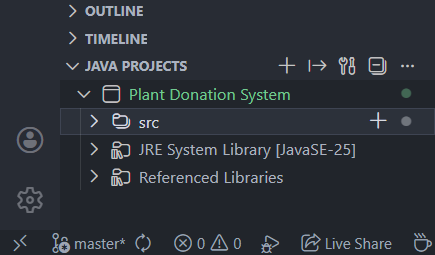

# Plant Donation System

## Overview

This project is a Java-based desktop application that facilitates plant donations and orders. It includes user registration, secure login with AES encryption, session management, and an admin dashboard for database interaction. The system connects to a MySQL database to manage plant inventory, donations, and orders.


## Features

### 1. **User Authentication**

- Secure login with username and password
- AES encryption for password storage
- Session management with automatic logout
- User registration with validation

### 2. **Donation System**

- Donate plants (Hibiscus, Mango, Neem, Banyan)
- Monetary donations
- Real-time inventory updates
- Donation history tracking

### 3. **Order Management**

- Browse available plants with live inventory
- Place orders with quantity selection
- Multiple payment options (Cash, Card, UPI)
- Automatic price calculation and inventory deduction

### 4. **Admin Dashboard**

- View all database tables in tabbed interface
- Real-time data visualization
- User management capabilities
- Transaction monitoring

### 5. **Security Features**

- AES encryption for sensitive data
- Prepared statements to prevent SQL injection
- Session-based access control
- Admin role verification

## Prerequisites

Before setting up the project, ensure you have:

- **Visual Studio Code** ([Download](https://code.visualstudio.com/download/))
- **Extension Pack for Java** (Install from VS Code Extensions)
- **Java Development Kit (JDK) 17 or higher** ([Download](https://www.oracle.com/in/java/technologies/downloads/))
- **MySQL Server** ([Download](https://dev.mysql.com/downloads/mysql/))
- **MySQL Connector/J** (Already included in repository)

## Installation & Setup

Follow these steps carefully to set up the project on your computer:

### Step 1: Clone the Repository

Open your terminal or command prompt and run:

```bash
git clone https://github.com/tanishqmudaliar/Plant-Donation-System.git
cd Plant-Donation-System
```

### Step 2: Open Project in VS Code

1. Launch **Visual Studio Code**
2. Go to **File → Open Folder**
3. Navigate to and select the `Plant-Donation-System` folder
4. Click **Select Folder**

### Step 3: Install VS Code Java Extensions

1. Open the Extensions view (`Ctrl+Shift+X` or `Cmd+Shift+X` on Mac)
2. Search for "Extension Pack for Java"
3. Click **Install** on the official Microsoft extension pack
4. Wait for all Java extensions to install

### Step 4: Verify Java Installation

1. Open VS Code Terminal (**View → Terminal** or `` Ctrl+` ``)
2. Check Java version:
   ```bash
   java -version
   ```
3. You should see output like:
   ```bash
   java version "25.0.1" 2025-10-21 LTS
   Java(TM) SE Runtime Environment (build 25.0.1+8-LTS-27)
   Java HotSpot(TM) 64-Bit Server VM (build 25.0.1+8-LTS-27, mixed mode, sharing)
   ```
4. If not installed, download JDK from [Oracle](https://www.oracle.com/in/java/technologies/downloads/) or [OpenJDK](https://openjdk.org/)

### Step 5: MySQL Database Setup

#### A. Install MySQL Server

1. Download MySQL Server from [MySQL Downloads](https://dev.mysql.com/downloads/mysql/)
2. Run the installer
3. During installation:
   - **Remember the root password** you set
   - **Note the port number** (default is 3306)

#### B. Create Database and Tables

1. Open **Command Prompt** or **MySQL Workbench** or **MySQL Command Line Client**
2. Log in with your root password
3. Execute the following SQL script:

```sql
-- Create Database
CREATE DATABASE plant_donation;
USE plant_donation;

-- Create Users Table
CREATE TABLE users (
    id INT AUTO_INCREMENT PRIMARY KEY,
    username VARCHAR(50) UNIQUE NOT NULL,
    name VARCHAR(100) NOT NULL,
    email VARCHAR(100) UNIQUE NOT NULL,
    mobile VARCHAR(15) NOT NULL,
    dob DATE NOT NULL,
    gender VARCHAR(10) NOT NULL,
    password VARCHAR(255) NOT NULL,
    is_admin BOOLEAN DEFAULT FALSE
);

-- Create Storage/Inventory Table
CREATE TABLE storage (
    id INT PRIMARY KEY,
    hibiscus INT DEFAULT 0,
    mango INT DEFAULT 0,
    neem INT DEFAULT 0,
    banyan INT DEFAULT 0,
    money_collected INT DEFAULT 0
);

-- Initialize Storage (Required for the app to function)
INSERT INTO storage (id, hibiscus, mango, neem, banyan, money_collected)
VALUES (1, 50, 50, 50, 50, 0);

-- Create Donations Table
CREATE TABLE donations (
    id INT AUTO_INCREMENT PRIMARY KEY,
    user_id INT NOT NULL,
    donation_type VARCHAR(50) NOT NULL,
    donation_detail VARCHAR(255) NOT NULL,
    created_at TIMESTAMP DEFAULT CURRENT_TIMESTAMP,
    FOREIGN KEY (user_id) REFERENCES users(id) ON DELETE CASCADE
);

-- Create Orders Table
CREATE TABLE orders (
    id INT AUTO_INCREMENT PRIMARY KEY,
    user_id INT NOT NULL,
    hibiscus INT DEFAULT 0,
    mango INT DEFAULT 0,
    neem INT DEFAULT 0,
    banyan INT DEFAULT 0,
    price INT NOT NULL,
    address TEXT NOT NULL,
    payment_type VARCHAR(50) NOT NULL,
    created_at TIMESTAMP DEFAULT CURRENT_TIMESTAMP,
    FOREIGN KEY (user_id) REFERENCES users(id) ON DELETE CASCADE
);
```

#### C. Verify Database Creation

Run this query to verify:

```sql
SHOW TABLES;
```

You should see: `users`, `storage`, `donations`, `orders`

### Step 6: Configure Database Connection

1. In VS Code, open `src/MySQL.java`
2. Update the following lines with your MySQL credentials:

```java
private static final String URL = "jdbc:mysql://localhost:3306/plant_donation";
private static final String USER = "root";
private static final String PASSWORD = "YOUR_MYSQL_PASSWORD"; // Change this!
```

**Important Notes:**

- Replace `YOUR_MYSQL_PASSWORD` with the password you set during MySQL installation
- If MySQL runs on a different port, change `3306` to your port number
- If you created a different database user, update `USER` accordingly

### Step 7: Add MySQL Connector Library

The MySQL Connector/J is already included in the repository, but you need to reference it:

1. In VS Code, look at the **Explorer** sidebar
2. Find the **Java Projects** section (usually at the bottom)
3. Expand **Referenced Libraries**
4. If `mysql-connector-j-x.x.x.jar` is not listed:
   - Click the **+** icon next to "Referenced Libraries"
   - Navigate to the project root or `lib/` folder
   - Select the `mysql-connector-j-x.x.x.jar` file



### Step 8: Run the Application

1. In VS Code Explorer, navigate to `src/LoginPage.java`
2. Right-click anywhere in the file editor
3. Select **Run Java**
4. The Login window should appear

**First Time Setup:**

- Click **"Create Account"** to register a new user
- Fill in all required fields
- Check **"Register as Admin"** if you want admin privileges
- After registration, log in with your credentials

## Project Structure

```
Plant-Donation-System/
├── src/
│   ├── Assets/                      # UI Images and Icons
│   │   ├── home screen.png
│   │   ├── heading.png
│   │   ├── donate.png
│   │   ├── buy.png
│   │   ├── donate frame head.png
│   │   └── order frame head.png
│   ├── AdminPage.java               # Admin dashboard
│   ├── CenteredComboBoxRenderer.java # UI component
│   ├── EncryptionUtil.java          # AES encryption utility
│   ├── HomePage.java                # Main user interface
│   ├── LoginPage.java               # Application entry point
│   ├── MySQL.java                   # Database connection
│   ├── RegistrationPage.java        # User registration
│   ├── SessionUtil.java             # Session management
│   └── WordWrapCellRenderer.java    # Table cell renderer
├── lib/                             # External libraries
│   └── mysql-connector-j-x.x.x.jar
└── README.md
```

## Database Schema

### Users Table

Stores user account information with encrypted passwords.

### Storage Table

Tracks plant inventory and collected donations.

### Donations Table

Records all plant and monetary donations.

### Orders Table

Logs all plant orders with pricing and delivery details.

## Troubleshooting

### Common Issues and Solutions

#### 1. "No suitable driver found for jdbc:mysql://localhost:3306/plant_donation"

**Solution:** Ensure MySQL Connector/J is added to Referenced Libraries in VS Code.

#### 2. "Access denied for user 'root'@'localhost'"

**Solution:** Verify MySQL password in `MySQL.java` matches your MySQL installation.

#### 3. "Table 'plant_donation.users' doesn't exist"

**Solution:** Execute the SQL script from Step 5B to create all tables.

#### 4. Images not showing

**Solution:** Update image paths in `HomePage.java` to use relative paths starting with `src/Assets/`.

#### 5. "Could not find or load main class"

**Solution:**

- Ensure Java extension pack is installed
- Reload VS Code window (Ctrl+Shift+P → "Developer: Reload Window")
- Check that JDK is properly configured

#### 6. MySQL service not running

**Solution:**

- **Windows:** Open Services, find MySQL, click Start
- **Mac:** `sudo /usr/local/mysql/support-files/mysql.server start`
- **Linux:** `sudo systemctl start mysql`

## Security Considerations

- Change the AES encryption key in `EncryptionUtil.java` for production use
- Use environment variables for database credentials instead of hardcoding
- Implement HTTPS if deploying as a web application
- Regular database backups recommended

## Usage

1. **Register**: Create a new account from the login page
2. **Login**: Use your credentials to access the system
3. **Donate**: Choose to donate plants or money from the home page
4. **Order**: Browse available plants and place orders
5. **Admin**: Access admin dashboard (admin users only) to view all data

## Contributing

Contributions are welcome! Please fork the repository and submit a pull request.

## License

This project is open source and available under the [MIT License](LICENSE).

## Author

Tanishq Mudaliar - [GitHub Profile](https://github.com/tanishqmudaliar)

## Contact

For issues or questions, please open an issue on GitHub or contact the repository owner.

---

**Note:** This is an educational project. For production use, implement additional security measures and follow best practices for database management and password storage.
